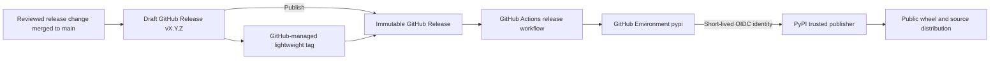

# Release architecture and maintainer guide

This project publishes `fastapi-request-observability` to PyPI without storing
a PyPI write token in GitHub. GitHub Actions authenticates to PyPI through
OpenID Connect (OIDC), builds the wheel and source distribution from the
reviewed release tag, validates both artifacts, and publishes them with `uv`.

This document describes the public release architecture and the steps a
maintainer follows. It intentionally contains no credentials, one-time
passwords, recovery codes, session data, or secret values.

## Architecture



The release boundary has five parts:

1. **Reviewed source:** Version metadata, changelog, code, and documentation are
   merged before a draft release is created. The draft targets the exact
   reviewed commit on `main`.
2. **GitHub Release:** Creating the draft with `--target` lets GitHub create the
   lightweight tag. Publishing the reviewed draft triggers the workflow. Do
   not push the release tag separately.
3. **GitHub Environment:** The publish job uses Environment `pypi`, whose
   deployment policy permits `v*` tags. The workflow does not read a PyPI
   password or API-token secret.
4. **PyPI trusted publisher:** The job receives `id-token: write` permission.
   PyPI accepts the short-lived OIDC identity only when its repository,
   workflow, and Environment claims match the configured publisher.
5. **Immutable public release:** Publishing the GitHub Release immediately
   authorizes the PyPI upload. Published GitHub Releases and PyPI filenames are
   immutable, so review must finish before publication.

Trusted publishing replaces a long-lived registry credential; it does not by
itself attest to artifact contents. The workflow records SHA-256 hashes, but it
does not currently generate PyPI attestations. Do not describe a release as
attested unless the workflow is deliberately extended and PyPI shows those
attestations.

## Public release configuration

| Setting | Value |
| --- | --- |
| PyPI project | `fastapi-request-observability` |
| Python import package | `fastapi_request_observability` |
| Package index | `https://pypi.org/` |
| GitHub repository | `janisto/fastapi-observability` |
| Workflow | `.github/workflows/release.yml` |
| Trusted-publisher workflow name | `release.yml` |
| GitHub Environment | `pypi` |
| Environment deployment policy | `v*` tags |
| Runner | GitHub-hosted `ubuntu-latest` |
| Workflow trigger | GitHub Release `published` |
| Tag creation | `gh release create --target` against the reviewed commit |
| Build frontend and backend | `uv build --no-sources` and `uv_build` |
| Local build recipe | `just build`, which depends on `clean-dist` |
| Standalone local cleanup | `just clean-dist` |
| Publish command | `uv publish --trusted-publishing always` |
| Release Python | Python 3.14 |
| Release notes | GitHub-generated, reconciled with `CHANGELOG.md`, and maintainer-reviewed |
| Stable GitHub Release label | `Latest` |

The PyPI trusted-publisher form uses owner `janisto`, repository
`fastapi-observability`, workflow filename `release.yml`, and Environment
`pypi`. The workflow filename is not the full `.github/workflows/release.yml`
path. These identity fields are case-sensitive.

Before the first trusted release, and after changing the repository owner or
name, workflow filename, Environment, or PyPI project, reopen the PyPI
publishing settings and verify them against this table. A trusted publisher is
an authorization boundary: changes to `release.yml` require the same review as
changes to a registry credential.

## What the workflow does

The release workflow:

1. checks out the explicit GitHub Release tag with full history and without
   persisting GitHub credentials;
2. installs the pinned uv version and Python 3.14 without using an action cache;
3. verifies that the release tag is exactly `v` plus
   `pyproject.toml#project.version`;
4. proves that the tagged commit belongs to `origin/main`;
5. builds one wheel and one source distribution with `uv build --no-sources`;
6. inspects their package name, version, Python requirement, dependency,
   license, project URLs, required files, and forbidden content;
7. installs the wheel and source distribution independently and exercises the
   public middleware, request context, trace parsing, response header, and
   structured access record;
8. records SHA-256 hashes for both distributions; and
9. uses `uv publish --trusted-publishing always` to require OIDC and upload both
   files to PyPI.

The workflow intentionally invokes `uv` directly because GitHub Actions starts
from a fresh checkout. The repository's canonical [`Justfile`](Justfile) is the
maintainer-facing local cleanup and validation layer: `build` depends on
`clean-dist`, and `clean-dist` removes only the generated `dist/` directory.

## Maintainer release guide

### 1. Prepare the version

Create a normal review branch and:

1. update `project.version` in `pyproject.toml`;
2. update `EXPECTED_VERSION` in `tests/check_distribution.py`;
3. run `uv lock` so the editable package version in `uv.lock` agrees;
4. move the applicable entries under a dated `CHANGELOG.md` release heading,
   keep an empty `Unreleased` heading, and update the comparison links;
5. update documentation for every public API or structured-field change.

Use `X.Y.Z` for a stable release. A prerelease must be valid Python package
metadata, and its tag must still equal `v` plus the exact project version.

Do not create the Git tag during version preparation. Version, changelog, code,
tests, and documentation must be reviewed together.

### 2. Run the release checks

```bash
just install
uv lock --check
just check
just package-check
git diff --check
```

`just check` runs Ruff lint and formatting checks, Ty, pytest, branch coverage,
and the repository's coverage threshold. `just package-check` reaches the
`build` recipe, whose `clean-dist` prerequisite removes `dist/` before building
the exact wheel and source distribution. It then inspects their metadata and
contents and runs the smoke test against each artifact in an isolated
environment. Both commands are required; `just package-check` does not include
the source-level QA gate.

Cleaning `dist/` prevents artifacts from an older version from making the
one-wheel and one-source-distribution assertions ambiguous. It also prevents a
deleted or renamed module from surviving a local rebuild.
Run `just clean-dist` independently to remove generated distributions without
starting a new build.

Merge the release preparation through a green pull request to `main`.

### 3. Draft and review the GitHub Release

Confirm that the tag, GitHub Release, and PyPI version do not already exist.
Then use the same draft-first GitHub CLI flow as the sibling observability
repositories:

```bash
git fetch origin main
git switch main
git merge --ff-only origin/main

VERSION="$(uv version --short)"
TARGET="$(git rev-parse origin/main)"

gh release create "v$VERSION" \
  --target "$TARGET" \
  --title "v$VERSION" \
  --generate-notes \
  --latest \
  --fail-on-no-commits \
  --draft

gh release view "v$VERSION" --web
```

Before creating the draft, verify that `TARGET` is the exact reviewed commit
that should be released. Do not use a newer unreviewed `main` commit merely
because it is currently at the branch tip.

Review the generated previous tag, merged pull requests, contributors, and
full-changelog link. Edit the notes for accuracy and clarity, and ensure every
user-visible statement agrees with `CHANGELOG.md`.

For a stable version, leave **This is a pre-release** cleared and select
**Set as latest release**. For a prerelease, select **This is a pre-release**
and do not mark it Latest. PyPI has no npm-style distribution tags: either kind
of GitHub Release causes an immediate upload of its exact Python version.

Verify the tag, target commit, title, notes, and release labels before
publishing. Publishing is the authorization event; there is no second staging
or approval step on PyPI.

For a prerelease, replace `--latest` in the create command with
`--prerelease --latest=false`.

Do not push the release tag separately. `gh release create` manages the
lightweight tag from `TARGET`; publishing the draft activates release
immutability for its tag and release assets.

### 4. Publish and monitor

After browser review, publish an unchanged stable draft and explicitly mark it
Latest:

```bash
gh release edit "v$VERSION" --draft=false --latest
```

For a prerelease, preserve both release labels explicitly:

```bash
gh release edit "v$VERSION" \
  --draft=false \
  --prerelease \
  --latest=false
```

Open or watch the resulting **Release** workflow:

```bash
gh run list --workflow release.yml --event release --limit 5
gh run watch <run-id> --exit-status
```

The **Publish to PyPI** job must finish successfully. Confirm that tag/version
validation, `main` ancestry, artifact inspection, both smoke tests, hash
recording, and trusted publication all passed. The workflow must not request a
PyPI token or interactive credential.

### 5. Verify the public release

Check the GitHub release and immutable tag:

```bash
gh release view "v$VERSION" \
  --json tagName,name,url,isDraft,isImmutable,isPrerelease,publishedAt,targetCommitish
gh api \
  "repos/janisto/fastapi-observability/git/ref/tags/v$VERSION" \
  --jq .object.sha
```

Read back the public PyPI metadata, require exactly one wheel and one source
distribution, and print their registry hashes:

```bash
export VERSION=X.Y.Z
uv run --no-project python - <<'PY'
import json
import os
from urllib.request import urlopen

project = "fastapi-request-observability"
version = os.environ["VERSION"]
url = f"https://pypi.org/pypi/{project}/{version}/json"

with urlopen(url, timeout=30) as response:  # noqa: S310 - fixed PyPI URL
    metadata = json.load(response)

assert metadata["info"]["version"] == version
files = metadata["urls"]
assert len(files) == 2
assert {item["packagetype"] for item in files} == {"bdist_wheel", "sdist"}

for item in sorted(files, key=lambda value: value["packagetype"]):
    print(item["packagetype"], item["filename"], item["digests"]["sha256"])
PY
```

Compare those SHA-256 values with the **Record distribution hashes** step in
the release workflow. Then install from the public registry, bypass the local
project and package cache, and run the built-package smoke test:

```bash
uv run --isolated --no-project \
  --refresh-package fastapi-request-observability \
  --with "fastapi-request-observability==$VERSION" \
  tests/smoke_test.py
```

Finally, verify that:

- the PyPI project page shows the released version and both distributions;
- the GitHub Release tag points to the reviewed commit;
- a stable GitHub Release carries the **Latest** label;
- the GitHub Release is immutable;
- the changelog, release notes, and published behavior agree; and
- the repository remains clean after verification.

## Failure and recovery

- **OIDC authentication fails:** Verify the PyPI trusted publisher's
  case-sensitive owner, repository, workflow filename, and Environment. Confirm
  that the job uses a GitHub-hosted runner with job-level `id-token: write`.
  Do not add a token fallback.
- **The workflow fails before upload:** First confirm that PyPI has no files for
  the version. A purely transient run may be retried against the unchanged tag
  and release. A source, metadata, or workflow correction requires a new
  reviewed version; never move the published tag to a different commit.
- **Only part of the release reaches PyPI:** Stop and inspect the registry file
  list and hashes before any retry. Do not overwrite an existing filename or
  blindly rerun publication. Complete only with byte-identical reviewed
  artifacts when the registry permits it; otherwise publish a corrected higher
  version.
- **A public release is defective:** Yank it on PyPI when appropriate and
  publish a corrected higher version. Never delete and reuse a public version.
- **GitHub and PyPI disagree:** Treat the release as incomplete. Preserve the
  public evidence, identify which boundary failed, and reconcile through a new
  reviewed version rather than rewriting history.
- **PyPI attestations are absent:** This is expected in the current workflow.
  Trusted OIDC publication authenticates the workflow, but `uv publish` does
  not generate attestations by itself.

## Official documentation

- [PyPI trusted publishing](https://docs.pypi.org/trusted-publishers/)
- [Adding a PyPI trusted publisher](https://docs.pypi.org/trusted-publishers/adding-a-publisher/)
- [PyPI trusted-publishing security model](https://docs.pypi.org/trusted-publishers/security-model/)
- [Building and publishing with uv](https://docs.astral.sh/uv/guides/package/)
- [`gh release create`](https://cli.github.com/manual/gh_release_create)
- [`gh release edit`](https://cli.github.com/manual/gh_release_edit)
- [GitHub OIDC](https://docs.github.com/en/actions/reference/security/oidc)
- [GitHub deployment environments](https://docs.github.com/en/actions/concepts/workflows-and-actions/deployment-environments)
- [GitHub Release workflow events](https://docs.github.com/en/actions/reference/workflows-and-actions/events-that-trigger-workflows#release)
- [GitHub releases](https://docs.github.com/en/repositories/releasing-projects-on-github)
- [GitHub immutable releases](https://docs.github.com/en/code-security/concepts/supply-chain-security/immutable-releases)
- [PyPI yanking](https://docs.pypi.org/project-management/yanking/)
